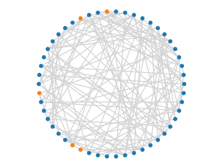
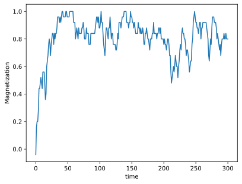

# Thermocracy

A small Python library to run the Ising model on arbitrary meshes, with versatility in mind. Not optimized for efficiency.

Here's an example of how it's used:

[*Dislike of general opinion makes for tight elections*](http://dx.doi.org/10.1103/PhysRevE.109.044106), O. Devauchelle, P. Szymczak, P. Nowakowski, Physical Review E, 109, 044106, 2024, [HAL](https://hal.science/hal-04533069/document), [arXiv](https://arxiv.org/pdf/2402.12207)

## Simple example

We first define a connectivity matrix:

```python
from pylab import *
import thermocracy as thm

nb_of_nodes = 50
connectivity = ( rand( *[nb_of_nodes]*2 ) > .9 )*1
```

We then define a Hamiltonian, for instance the classical Ising Hamiltonian, plus an additionnal term proportional to the total magnetization:

$$
{\cal H} = - \sum_{i,j=0}^{N-1} J_{ij} s_i s_j + { N \varepsilon \bar{s}^2}
$$

Chosing $\varepsilon=1$, we write:

```python
H = thm.Hamiltonian( terms = [ thm.neighbors_influence, thm.polls_influence ], coeffs = [ 1, 1 ] )
```

We then define a population of nodes based on this Hamiltonian, and the connectivity matrix:

```python
pop = thm.population( connectivity = connectivity, H = H, beta = .2, state = None )
```

In the line above, `beta` is the inverse temperature. We can now run a simulation with the Glauber algorithm:

```python
X_mean = [ mean( pop.state ) ]

for _ in range(300)   :
    pop.evolve(10)
    X_mean += [ mean( pop.state ) ]
```

We can represent the last state of the population, with an arbitrary distribution of the nodes in the plane:

```python
theta =  linspace( 0, 2*pi, nb_of_nodes + 1 )[:-1]
x, y = cos(theta), sin(theta)

thm.plot_connectivity( connectivity = pop.connectivity, x = x, y = y, color = 'LightGrey' )

plus = pop.state > 0
plot( x[plus], y[plus],'o', color = 'tab:blue')
plot( x[~plus], y[~plus],'o', color = 'tab:orange')
```

The result looks like this:



Despite the additional collective term in the Hamiltonian, the magnetization converges to 1 or -1. This is not the case in larger systems.

```python
plot( X_mean )
xlabel('time')
ylabel('Magnetization')
```


